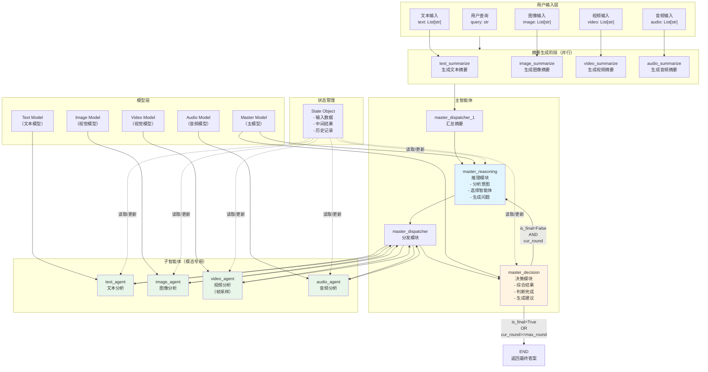
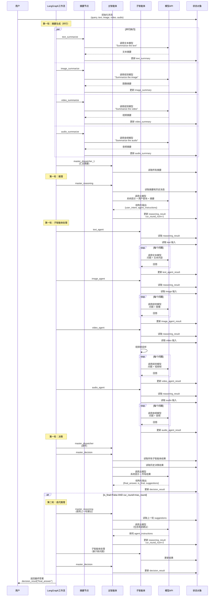
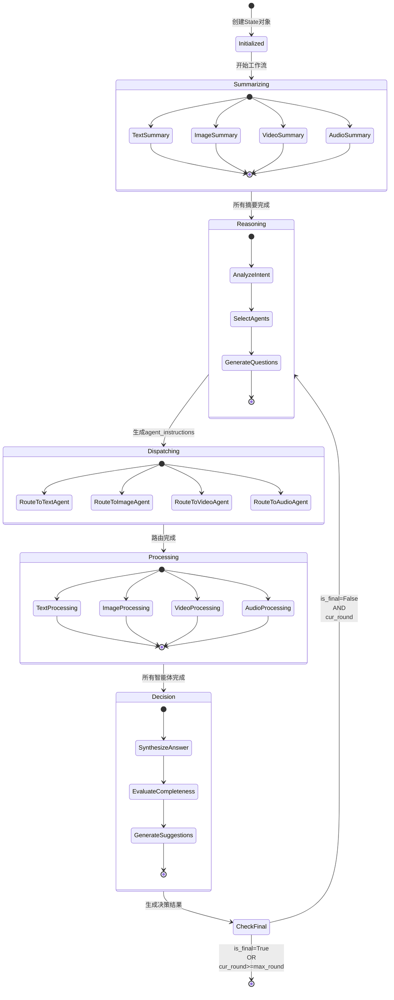
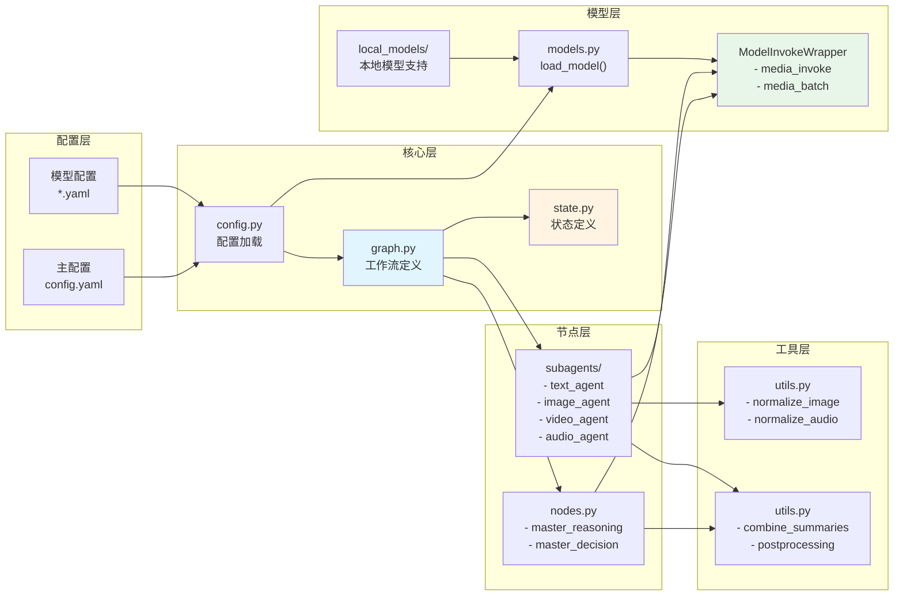

# Agent-Omni 架构与数据流图

## 系统架构图



## 数据流详细图



## 状态流转图



## 组件交互图



## 数据格式示例

### 输入数据格式

```python
State(
    query="请总结提供材料的内容",
    text=["文档内容..."],
    image=["image.jpeg"],
    video=["video.mp4"],
    audio=["audio.wav"],
    cur_round_num=0,
    max_round_num=3
)
```

### 推理结果格式

```json
{
    "user_intent": "总结多模态内容",
    "agent_instructions": [
        {
            "agent_name": "text_agent",
            "questions": [
                "文档的主要主题是什么？",
                "文档中提到了哪些关键点？"
            ]
        },
        {
            "agent_name": "image_agent",
            "questions": [
                "图像中显示了什么内容？",
                "图像中的关键元素是什么？"
            ]
        }
    ]
}
```

### 决策结果格式

```json
{
    "final_answer": "综合所有材料，主要内容包括...",
    "is_final": false,
    "suggestions_for_next_round": [
        "可以更详细地分析图像中的细节",
        "需要检查视频中的时间序列信息"
    ]
}
```

### 子智能体结果格式

```json
[
    {
        "question": "文档的主要主题是什么？",
        "answer": "文档主要讨论了..."
    },
    {
        "question": "文档中提到了哪些关键点？",
        "answer": "关键点包括..."
    }
]
```

