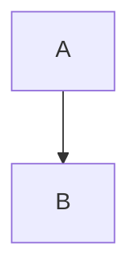

# 架构图使用指南

`ARCHITECTURE_DIAGRAM.md` 文件包含多个 Mermaid 图表，用于可视化 Agent-Omni 的架构和数据流。以下是查看和使用这些图表的多种方法。

## 方法 1：在 VS Code / Cursor 中查看（推荐）

### 安装 Mermaid 预览插件

1. **VS Code / Cursor 插件市场搜索并安装**：
   - `Markdown Preview Mermaid Support` (bierner.markdown-mermaid)
   - 或 `Mermaid Preview` (vstirbu.vscode-mermaid-preview)

2. **使用方法**：
   - 打开 `ARCHITECTURE_DIAGRAM.md`
   - 按 `Ctrl+Shift+V` (Windows/Linux) 或 `Cmd+Shift+V` (Mac) 打开 Markdown 预览
   - 图表会自动渲染显示

### 或者使用专门的 Mermaid 查看器

安装插件：`Mermaid Editor` (tomoyukim.vscode-mermaid-editor)

- 右键点击 `.md` 文件中的 mermaid 代码块
- 选择 "Open Mermaid Editor"
- 可以在独立窗口中查看和编辑图表

## 方法 2：在线 Mermaid 编辑器

1. **访问 Mermaid Live Editor**：
   - https://mermaid.live/
   - 或 https://mermaid-js.github.io/mermaid-live-editor/

2. **复制代码块**：
   - 打开 `ARCHITECTURE_DIAGRAM.md`
   - 找到想要查看的图表（例如 "系统架构图"）
   - 复制 ` ```mermaid` 和 ` ``` ` 之间的代码

3. **粘贴并查看**：
   - 粘贴到在线编辑器的左侧代码区
   - 右侧会自动渲染图表
   - 可以导出为 PNG/SVG

## 方法 3：GitHub / GitLab 查看

如果你将代码推送到 GitHub 或 GitLab：

1. **直接查看**：
   - GitHub 和 GitLab 原生支持 Mermaid
   - 直接在仓库中打开 `.md` 文件即可看到渲染后的图表

2. **示例**：
   ```
   https://github.com/your-username/Agent-Omni/blob/main/ARCHITECTURE_DIAGRAM.md
   ```

## 方法 4：导出为图片

### 使用 Mermaid CLI

1. **安装 Mermaid CLI**：
   ```bash
   npm install -g @mermaid-js/mermaid-cli
   ```

2. **导出单个图表**：
   ```bash
   # 从文件中提取 mermaid 代码并导出
   mmdc -i ARCHITECTURE_DIAGRAM.md -o architecture.png
   ```

### 使用在线工具导出

1. 访问 https://mermaid.live/
2. 粘贴 mermaid 代码
3. 点击右上角 "Actions" → "Download PNG" 或 "Download SVG"

## 方法 5：在文档中使用

### 在 Jupyter Notebook 中

```python
# 安装 mermaid
!pip install mermaid

# 在 Markdown cell 中使用

```

### 在 Confluence / Notion 中

- **Confluence**：安装 "Mermaid for Confluence" 插件
- **Notion**：使用 `/mermaid` 命令创建图表

## 方法 6：命令行查看（文本模式）

如果只需要快速查看图表结构，可以直接阅读 `.md` 文件中的文本描述。

## 图表说明

`ARCHITECTURE_DIAGRAM.md` 包含以下图表：

1. **系统架构图** (`graph TB`)
   - 展示整体系统架构和组件关系
   - 适合理解系统设计

2. **数据流详细图** (`sequenceDiagram`)
   - 展示详细的执行时序
   - 适合理解数据流转过程

3. **状态流转图** (`stateDiagram-v2`)
   - 展示状态变化过程
   - 适合理解状态机逻辑

4. **组件交互图** (`graph LR`)
   - 展示组件之间的依赖关系
   - 适合理解模块化设计

5. **数据格式示例**
   - JSON 格式示例
   - 适合理解数据结构

## 快速开始

**最简单的方法**：

1. 打开 `ARCHITECTURE_DIAGRAM.md`
2. 访问 https://mermaid.live/
3. 复制第一个图表代码（系统架构图）
4. 粘贴到在线编辑器查看

## 故障排除

### 图表不显示？

1. **检查代码块格式**：
   - 确保使用 ` ```mermaid` 而不是 ` ``` mermaid`（注意空格）
   - 确保代码块正确闭合

2. **检查 Mermaid 语法**：
   - 访问 https://mermaid.live/ 验证语法
   - 查看 Mermaid 官方文档：https://mermaid.js.org/

3. **更新插件**：
   - 确保 VS Code/Cursor 插件是最新版本

### 图表显示不完整？

- 某些复杂的图表可能需要调整视图大小
- 尝试使用在线编辑器查看完整图表
- 导出为图片后查看

## 编辑图表

如果需要修改图表：

1. **在线编辑**（推荐）：
   - 使用 https://mermaid.live/
   - 实时预览修改效果

2. **本地编辑**：
   - 直接编辑 `.md` 文件中的 mermaid 代码块
   - 使用支持 Mermaid 的编辑器实时预览

## 推荐工作流

1. **开发时**：在 VS Code/Cursor 中使用插件实时预览
2. **分享时**：推送到 GitHub，直接查看渲染后的图表
3. **演示时**：导出为 PNG/SVG 图片，插入到 PPT/文档中

## 相关资源

- **Mermaid 官方文档**：https://mermaid.js.org/
- **Mermaid 语法指南**：https://mermaid.js.org/intro/syntax-reference.html
- **在线编辑器**：https://mermaid.live/
- **GitHub Mermaid 支持**：https://github.blog/2022-02-14-include-diagrams-markdown-files-mermaid/

