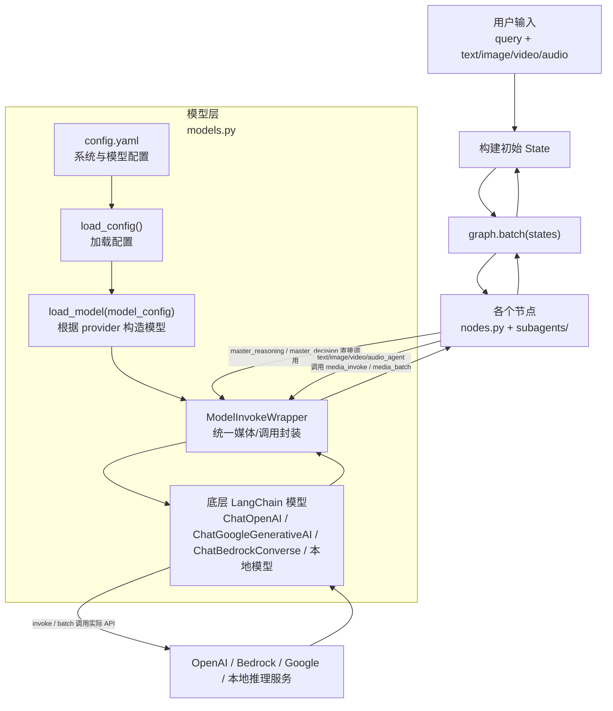

## 模型构造与调用全流程解析

本文详细解析 Agent-Omni 中“**从配置到模型实例化**”以及“**从子 Agent 到底层大模型调用**”的完整链路，并给出一张整体流程图，帮助你快速理解 `models.py` 和各个 `subagents` 是如何协同工作的。

---

## 一、整体流程图

### 1. 顶层数据流（从用户到大模型）




---

## 二、模型构造流程（`config.yaml` → `load_model` → `ModelInvokeWrapper`）

### 1. 配置加载：`config.py`

- **配置文件位置**：`src/config.yaml`
- **核心函数**：`load_config()`（`src/config.py`）

配置加载流程：

1. 启动时导入 `config.py`，执行 `config = load_config()`
2. `load_config()`：
   - 计算默认路径：`src/config.yaml`
   - 支持通过环境变量 `CONFIG_PATH` 覆盖
   - 递归处理包含的其他 YAML（支持分模块配置）
3. 返回一个 **嵌套字典**，在后续代码中通过 `config["model"]["xxx"]` 等方式读取。

### 2. 每个模型的配置结构

以 `src/config.yaml` 为例（节选）：

```yaml
model:
  master_agent:
    api_provider: bedrock 
    model_id: us.anthropic.claude-3-7-sonnet-20250219-v1:0
    params:
      max_tokens: 4096
      temperature: 0

  text_agent:
    api_provider: bedrock 
    model_id: us.anthropic.claude-3-7-sonnet-20250219-v1:0
    params:
      max_tokens: 4096
      temperature: 0

  image_agent:
    api_provider: bedrock 
    model_id: us.anthropic.claude-3-7-sonnet-20250219-v1:0
    params:
      max_tokens: 4096
      temperature: 0

  video_agent:
    api_provider: openai
    model_id: Isotr0py/LLaVA-Video-7B-Qwen2-hf
    base_url: http://localhost:8000/v1
    max_image_input: 6
    max_frames_num: 30
    image_size: [336, 336]
    params:
      max_tokens: 4096
      temperature: 0

  audio_agent:
    api_provider: openai
    model_id: Qwen/Qwen2.5-Omni-7B
    base_url: http://localhost:8000/v1
    params:
      max_tokens: 4096
      temperature: 0
```

对应到代码里是在 `src/models.py` 的最后几行完成模型实例化：

```315:325:src/models.py
# 从配置文件中加载各种专用模型
# master_model: 主控模型，负责任务分解和协调
master_model = load_model(config["model"]["master_agent"])
# text_model: 文本处理专用模型
text_model = load_model(config["model"].get("text_agent", None))
# image_model: 图像处理专用模型
image_model = load_model(config["model"].get("image_agent", None))
# video_model: 视频处理专用模型
video_model = load_model(config["model"].get("video_agent", None))
# audio_model: 音频处理专用模型
audio_model = load_model(config["model"].get("audio_agent", None))
```

**总结**：当你在任意地方 `from src.models import text_model` 时，拿到的已经是 **封装后的可调用模型实例**（`ModelInvokeWrapper`）。

### 3. `load_model`：根据 provider 构造底层模型

核心函数在 `src/models.py`：

```33:91:src/models.py
def load_model(model_config):
    """
    根据配置加载相应的AI模型
    ...
    """
    if model_config is None:
        return None

    # 从配置中提取模型参数
    api_provider = model_config.get("api_provider", None)
    model_id = model_config.get("model_id", None)
    base_url = model_config.get("base_url", None)
    api_key_name = model_config.get("api_key_name", None)
    params = model_config.get("params", None)

    # 根据API提供商类型加载对应的模型
    if "openai" in api_provider:
        from langchain_openai import ChatOpenAI
        return ModelInvokeWrapper(ChatOpenAI(
            base_url=base_url,
            api_key="None" if api_key_name is None else os.environ.get(api_key_name, None),
            model_name=model_id,
            **(params or {}),
        ), api_provider=api_provider)
    elif "local" in api_provider:
        # 加载本地模型（从MODEL_MAP中获取）
        return ModelInvokeWrapper(MODEL_MAP[model_id](
            model_id=model_id,
            **(params or {})
        ), api_provider=api_provider)
    elif "bedrock" in api_provider:
        # 加载AWS Bedrock模型
        from langchain_aws import ChatBedrockConverse
        import boto3
        return ModelInvokeWrapper(ChatBedrockConverse(
            client=boto3.client("bedrock-runtime", region_name="us-east-1"),
            model=model_id,
            **(params or {})
        ), api_provider=api_provider)
    elif "google" in api_provider:
        # 加载Google Generative AI模型（如Gemini）
        from langchain_google_genai import ChatGoogleGenerativeAI
        api_key = os.environ.get(api_key_name, None) if api_key_name else None
        if api_key is None:
            raise ValueError(f"API key not found in environment variable: {api_key_name}")
        return ModelInvokeWrapper(ChatGoogleGenerativeAI(
            google_api_key=api_key,
            model=model_id,
            **(params or {})
        ), api_provider=api_provider)
    else:
        raise ValueError("Incorrect api provider")
```

- **输入**：单个模型的配置字典（`config["model"]["text_agent"]` 等）
- **逻辑**：
  - 根据 `api_provider` 选择具体 LangChain 模型类
  - 传入 `model_id`、`base_url`、`params` 等
  - 用 `ModelInvokeWrapper` 再包一层，以提供统一多模态与重试机制
- **输出**：一个 `ModelInvokeWrapper` 实例。

### 4. `ModelInvokeWrapper` 的职责

```99:116:src/models.py
class ModelInvokeWrapper:
    """
    模型调用包装器类
    为不同的AI模型提供统一的调用接口，支持多模态输入（文本、图像、音频）
    并提供重试机制以提高调用的可靠性
    """

    def __init__(self, model, api_provider=None):
        """
        初始化模型包装器
        """
        self.model = model
        self.api_provider = api_provider
```

它提供三层能力：

- **多模态封装 + 重试**：
  - `media_invoke(content)`：单次多模态调用
  - `media_batch(contents)`：批量多模态调用
- **透传底层 LangChain 模型**：
  - `invoke(*args, **kwargs)`：直接调用 `self.model.invoke`
  - `batch(*args, **kwargs)`：直接调用 `self.model.batch`
  - `__call__(*args, **kwargs)`：直接转发到 `self.model(...)`

---

## 三、消息构造与调用流程（多模态入口）

### 1. 多模态消息构造：`construct_message`

```117:203:src/models.py
def construct_message(self, system_prompt, question, text, image, audio):
    """
    构建多模态消息列表
    """
    messages = []
    if system_prompt is not None:
        messages.append(SystemMessage(content=system_prompt))

    content = []

    # 文本
    if text is not None:
        content.append({
            "type": "text",
            "text": str(text)
        })

    # 图像
    if image is not None:
        image = [image] if not isinstance(image, list) else image
        for img in image:
            data_url = normalize_image_to_data_url(img)
            content.append({
                "type": "image_url",
                "image_url": {"url": data_url}
            })

    # 音频
    if audio is not None:
        audio = [audio] if not isinstance(audio, list) else audio
        for aud in audio:
            data_url = normalize_audio_to_data_url(aud)
            if self.api_provider and "google" in self.api_provider:
                base64_data = extract_base64_from_data_url(data_url)
                content.append({
                    "type": "file",
                    "source_type": "base64",
                    "mime_type": "audio/wav",
                    "data": base64_data
                })
            else:
                content.append({
                    "type": "audio_url",
                    "audio_url": {"url": data_url}
                })

    # 最后追加用户问题
    content.append({
        "type": "text",
        "text": question
    })

    messages.append(HumanMessage(content=content))
    return messages
```

- **作用**：把 `question + text + image + audio` 统一封装成 LangChain 的 `SystemMessage` / `HumanMessage` 列表。
- **适配点**：
  - 图像统一转 data URL
  - 音频根据 `api_provider` 区分 Google（file+base64）和其他（audio_url）。

### 2. 单次多模态调用：`media_invoke`

```205:245:src/models.py
def media_invoke(self, content, *args, **kwargs):
    """
    调用模型处理多模态输入（单次调用）
    """
    system_prompt = content.get("system_prompt", None)
    question = content.get("question", None)
    text = content.get("text", None)
    image = content.get("image", None)
    audio = content.get("audio", None)

    # 构建消息
    messages = self.construct_message(system_prompt, question, text, image, audio)

    retry = config["system"]["retry_times"]
    while retry:
        try:
            response = self.model.invoke(messages)
            break
        except Exception as e:
            retry -= 1
            print(e, "remaining retry time:", retry)
            if retry <= 0:
                raise e
            time.sleep(15)
    return response
```

调用路径：

- 外部只需提供一个 `content` 字典
- 内部完成：
  - 多模态预处理（`construct_message`）
  - 重试控制
  - 调用底层 `self.model.invoke(messages)`

### 3. 批量多模态调用：`media_batch`

```248:285:src/models.py
def media_batch(self, contents, *args, **kwargs):
    """
    批量调用模型处理多模态输入（批处理）
    """
    messages_batch = []
    for content in contents:
        system_prompt = content.get("system_prompt", None)
        question = content.get("question", None)
        text = content.get("text", None)
        image = content.get("image", None)
        audio = content.get("audio", None)
        messages = self.construct_message(system_prompt, question, text, image, audio)
        messages_batch.append(messages)

    retry = config["system"]["retry_times"]
    while retry:
        try:
            responses = self.model.batch(messages_batch)
            break
        except Exception as e:
            retry -= 1
            print(e, "remaining retry time:", retry)
            if retry <= 0:
                raise e
            time.sleep(30)
    return responses
```

- **外部视角**：传入 `contents`（一个 `content` 字典的列表），拿到与之对应的 `responses` 列表。
- **内部视角**：
  - 先批量构造 `messages_batch`（每个元素都是消息列表）
  - 然后调用底层 `self.model.batch(messages_batch)`，利用 LangChain 的标准批量接口。

---

## 四、从 graph/nodes 到各个模型的调用链

### 1. 顶层工作流：`graph.py`

```25:40:src/graph.py
def _build_graph():
    builder = StateGraph(State)

    for node in [
        master_reasoning,
        master_dispatcher,
        master_dispatcher_1,
        master_decision,
        text_agent,
        image_agent,
        video_agent,
        audio_agent,
        text_summarize,
        image_summarize,
        video_summarize,
        audio_summarize,
    ]:
        builder.add_node(node)
```

- **入口**：测试中通过 `_graph.batch([state])` 启动整个工作流（见 `test/agent_test.py`）。
- **节点**：
  - `nodes.py`：`master_reasoning` / `master_decision` 等主控节点
  - `subagents/*.py`：`text_agent` / `image_agent` / `video_agent` / `audio_agent` 以及对应的 `*_summarize`

### 2. 主控模型调用：`nodes.py` 中的 `master_model`

```1:2:src/nodes.py
from src.models import master_model
from langchain_core.messages import SystemMessage, AIMessage, HumanMessage, ToolMessage
```

以 `master_reasoning` 为例：

```104:115:src/nodes.py
messages = get_messages(state, system_prompt, format_instructions)
response = master_model.invoke(messages)
try:
    result = parser.parse(response.content).dict()
except:
    result = fixing_parser.parse(response.content).dict()
```

- 这里使用的是 `ModelInvokeWrapper.invoke`，**不走多模态包装**，而是直接把拼好的 `messages` 传给底层模型。
- 这适用于“只用文本”的复杂结构化输出场景（推理/决策）。

### 3. 子 Agent 文本模型调用：`subagents/text_agent.py`

```1:4:src/subagents/text_agent.py
from ..models import text_model as model
from ..config import config
from ..state import State
from ..utils import postprocessing
```

生成问题并批量调用：

```40:49:src/subagents/text_agent.py
messages_batch = []
for question in questions:
    content = {
        # "system_prompt": system_prompt,
        "question": question,
        "text": state["text"]
    }
    messages_batch.append(content)

results = model.media_batch(messages_batch)
return results
```

调用链总结：

- 外部：`text_agent(state)` → `generate(state, questions)`
- `generate`：
  - 针对每个问题构造 `content` 字典
  - 调用 `text_model.media_batch(messages_batch)`
- `media_batch`：
  - 构造多模态 `messages_batch`
  - 调用 `text_model.model.batch(messages_batch)`（底层 LangChain 模型）

### 4. 图像 / 视频 / 音频 Agent 调用

- **图像 Agent**：`subagents/image_agent.py`

```31:45:src/subagents/image_agent.py
image_batch_size = config["model"]["image_agent"].get("max_image_input", len(state['image']))
if not isinstance(state["image"], list):
    state["image"] = [state["image"]]
for image_batch_begin in range(0, len(state['image']), image_batch_size):
    messages_batch = []
    for question in questions:
        content = {
            # "system_prompt": system_prompt,
            "question": question,
            "image": state['image'][image_batch_begin:image_batch_begin + image_batch_size]
        }
        messages_batch.append(content)

    responses = model.media_batch(messages_batch)
```

- **音频 Agent**：`subagents/audio_agent.py`

```31:46:src/subagents/audio_agent.py
if not isinstance(state["audio"], list):
    state["audio"] = [state["audio"]]
audio_batch_size = config["model"]["audio_agent"].get("max_audio_input", 1)
for audio_batch_begin in range(0, len(state['audio']), audio_batch_size):
    messages_batch = []
    for question in questions:
        content = {
            # "system_prompt": system_prompt,
            "system_prompt": "You are a helpful assistant.",
            "question": question,
            "audio": state['audio'][audio_batch_begin:audio_batch_begin + audio_batch_size]
        }
        messages_batch.append(content)

    responses = model.media_batch(messages_batch)
```

- **视频 Agent**：`subagents/video_agent.py`

```73:90:src/subagents/video_agent.py
if not isinstance(state["video"], list):
    state["video"] = [state["video"]]
for video in state['video']:
    frames, _, _  = sample_frames(video, config["model"]["video_agent"])
    image_batch_size = config["model"]["video_agent"].get("max_image_input", len(frames))
    for image_batch_begin in range(0, len(frames), image_batch_size):
        messages_batch = []
        for question in questions:
            content = {
                # "system_prompt": system_prompt,
                "system_prompt": "You are a helpful assistant.",
                "question": question,
                "image": frames[image_batch_begin:image_batch_begin + image_batch_size]
            }
            messages_batch.append(content)

        responses = model.media_batch(messages_batch)
```

**可以看到**：所有子 Agent 最终都通过 `model.media_batch` 走向同一套多模态封装逻辑。

---

## 五、调用方式速查（构造 vs 调用）

### 1. 模型构造阶段（只在导入时执行一次）

- **配置加载**：`config = load_config()`
- **模型构造**：
  - `master_model = load_model(config["model"]["master_agent"])`
  - `text_model = load_model(config["model"]["text_agent"])`
  - `image_model = load_model(config["model"]["image_agent"])`
  - `video_model = load_model(config["model"]["video_agent"])`
  - `audio_model = load_model(config["model"]["audio_agent"])`

### 2. 模型调用阶段（每次请求都会触发）

- **直接文本调用（主控）**：
  - `response = master_model.invoke(messages)`  
    （内部转为 `master_model.model.invoke(messages)`）
- **多模态单次调用**：
  - `response = model.media_invoke(content_dict)`
- **多模态批量调用**：
  - `responses = model.media_batch(list_of_content_dicts)`
- **完全绕过封装（不建议，一般不需要）**：
  - `master_model.model.invoke(...)`
  - `master_model.model.batch(...)`

---

## 六、理解“为什么能直接调用 batch/invoke？”

结合这份文档和 `MODEL_CALLING_GUIDE.md`：

- `load_model` 返回的 `ModelInvokeWrapper` 内部封装了一个 **LangChain Chat 模型实例**（如 `ChatOpenAI`、`ChatGoogleGenerativeAI` 等）
- 这些模型都继承自 `Runnable` → 提供统一接口：
  - `invoke(input)` / `batch(inputs)` / `stream(input)` / `astrem(..)` 等
- 因此：
  - 在 `ModelInvokeWrapper.media_batch` 里，可以安全地调用 `self.model.batch(messages_batch)`
  - 在测试中也可以直接对 `model` 使用 `.invoke`、`.batch`（见 `test/test_gemini.py`）

如果你以后接入新的模型，只要它实现了 LangChain 的 `Runnable` 接口（或继承自 `BaseChatModel`），就可以直接复用这套 **构造 + 调用** 流程，而不用改子 Agent 的调用逻辑。


